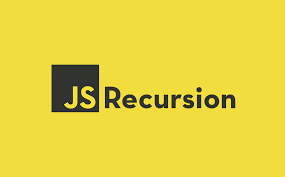
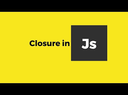

## Рекурсия — это когда функция вызывает сама себя, пока кто-то ее не остановит. Если никто это не остановит, то так и будет.рекурсия (вызов самого себя) навсегда. Рекурсивные функции позволяют выполнять единицу работы несколько раз.В современных языках программирования, таких как JavaScript, уже есть операторы for и while.альтернативы рекурсивным функциям. Но в некоторых языках, таких как Closure, циклов нет.операторы, поэтому вам нужно использовать рекурсию для многократного выполнения фрагмента кода.

## Clouse - Рекурсивная функция должна иметь условие, позволяющее прекратить вызов самой себя. В противном случаефункция вызывается бесконечно.Как только условие выполнено, функция перестает вызывать сама себя. Это называется базасостояние.Чтобы предотвратить бесконечную рекурсию, вы можете использовать оператор if...else (или аналогичный подход)где одна ветвь выполняет рекурсивный вызов, а другая нет.